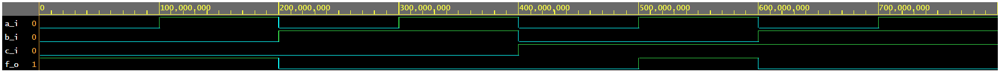
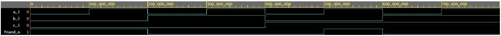
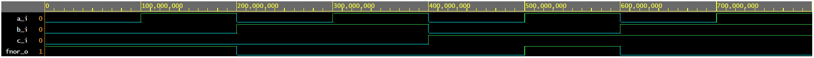

# Lab 1

### De Morgan's laws simulation

```bash
architecture dataflow of gates is
begin
	f_o <= ((not b_i) and a_i) or ((not c_i) and (not b_i));
        fnand_o <= (not(((not((not b_i) and a_i))) and ((not(( not c_i) and (not b_i))))));
        fnor_o <= ((not (b_i or (not a_i))) or (not ( c_i or b_i)));
end architecture dataflow;
```

### F(c,b,a)

| **c** | **b** |**a** | **f(c,b,a)** |
| :-: | :-: | :-: | :-: |
| 0 | 0 | 0 | 1 |
| 0 | 0 | 1 | 1 |
| 0 | 1 | 0 | 0 |
| 0 | 1 | 1 | 0 |
| 1 | 0 | 0 | 0 |
| 1 | 0 | 1 | 1 |
| 1 | 1 | 0 | 0 |
| 1 | 1 | 1 | 0 |



### F_nand(c,b,a)

| **c** | **b** |**a** | **f_nand(c,b,a)** |
| :-: | :-: | :-: | :-: |
| 0 | 0 | 0 | 1 |
| 0 | 0 | 1 | 1 |
| 0 | 1 | 0 | 0 |
| 0 | 1 | 1 | 0 |
| 1 | 0 | 0 | 0 |
| 1 | 0 | 1 | 1 |
| 1 | 1 | 0 | 0 |
| 1 | 1 | 1 | 0 |



### F_nor(c,b,a)

| **c** | **b** |**a** | **f_nor(c,b,a)** |
| :-: | :-: | :-: | :-: |
| 0 | 0 | 0 | 1 |
| 0 | 0 | 1 | 1 |
| 0 | 1 | 0 | 0 |
| 0 | 1 | 1 | 0 |
| 1 | 0 | 0 | 0 |
| 1 | 0 | 1 | 1 |
| 1 | 1 | 0 | 0 |
| 1 | 1 | 1 | 0 |



### odkaz na EDA Playground:
https://www.edaplayground.com/x/FJqJ
