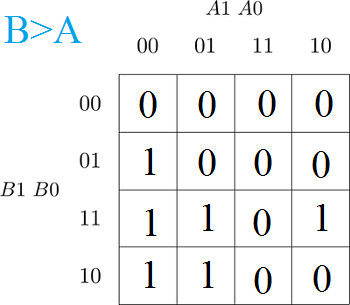

# Lab 2: Combinational logic


## Part 1: Preparation task

| **Dec. equivalent** | **B[1:0]** | **A[1:0]** | **B is greater than A** | **B equals A** | **B is less than A** |
| :-: | :-: | :-: | :-: | :-: | :-: |
| 0 | 0 0 | 0 0 | 0 | 1 | 0 |
| 1 | 0 0 | 0 1 | 0 | 0 | 1 |
| 2 | 0 0 | 1 0 | 0 | 0 | 1 |
| 3 | 0 0 | 1 1 | 0 | 0 | 1 |
| 4 | 0 1 | 0 0 | 1 | 0 | 0 |
| 5 | 0 1 | 0 1 | 0 | 1 | 0 |
| 6 | 0 1 | 1 0 | 0 | 0 | 1 |
| 7 | 0 1 | 1 1 | 0 | 0 | 1 |
| 8 | 1 0 | 0 0 | 1 | 0 | 0 |
| 9 | 1 0 | 0 1 | 1 | 0 | 0 |
| 10 | 1 0 | 1 0 | 0 | 1 | 0 |
| 11 | 1 0 | 1 1 | 0 | 0 | 1 |
| 12 | 1 1 | 0 0 | 1 | 0 | 0 |
| 13 | 1 1 | 0 1 | 1 | 0 | 0 |
| 14 | 1 1 | 1 0 | 1 | 0 | 0 |
| 15 | 1 1 | 1 1 | 0 | 1 | 0 |

## Part 2: Logic function minimization
### 1) B=A

### 2) B>A


SOP = A1'A0' + A1'B0 + A0'B1 + B1B0

### 3) B<A


POS = (A1' + B1) (A0' + B0)

## Part 3: Assertion statements in VHDL testbench

### design.vhd
```vhdl
library ieee;
use ieee.std_logic_1164.all;

------------------------------------------------------------------------
-- Entity declaration for 2-bit binary comparator
------------------------------------------------------------------------
entity comparator_2bit is
    port(
        a_i           : in  std_logic_vector(2 - 1 downto 0);
        b_i           : in  std_logic_vector(2 - 1 downto 0);

        -- COMPLETE ENTITY DECLARATION
        B_greater_A_o : out std_logic;
        B_equals_A_o  : out std_logic;
        B_less_A_o    : out std_logic       -- B is less than A
    );
end entity comparator_2bit;

------------------------------------------------------------------------
-- Architecture body for 2-bit binary comparator
------------------------------------------------------------------------
architecture Behavioral of comparator_2bit is
begin
    B_greater_A_o <= '1' when (b_i > a_i) else '0';
    B_equals_A_o  <= '1' when (b_i = a_i) else '0';
    B_less_A_o    <= '1' when (b_i < a_i) else '0';
    
end architecture Behavioral;


```

### testbench.vhd
```vhdl


library ieee;
use ieee.std_logic_1164.all;

------------------------------------------------------------------------
-- Entity declaration for testbench
------------------------------------------------------------------------
entity tb_comparator_2bit is
    -- Entity of testbench is always empty
end entity tb_comparator_2bit;

------------------------------------------------------------------------
-- Architecture body for testbench
------------------------------------------------------------------------
architecture testbench of tb_comparator_2bit is

    -- Local signals
    signal s_a       : std_logic_vector(2 - 1 downto 0);
    signal s_b       : std_logic_vector(2 - 1 downto 0);
    signal s_B_greater_A : std_logic;
    signal s_B_equals_A  : std_logic;
    signal s_B_less_A    : std_logic;

begin
    -- Connecting testbench signals with comparator_2bit entity (Unit Under Test)
    uut_comparator_2bit : entity work.comparator_2bit
        port map(
            a_i           => s_a,
            b_i           => s_b,
            B_greater_A_o => s_B_greater_A,
            B_equals_A_o  => s_B_equals_A,
            B_less_A_o    => s_B_less_A
        );

    --------------------------------------------------------------------
    -- Data generation process
    --------------------------------------------------------------------
    p_stimulus : process
    begin
 
        report "Stimulus process started" severity note;
        -- First test values
        s_b <= "00"; s_a <= "00"; wait for 100 ns;
        -- Expected output
        assert ((s_B_greater_A = '0') and (s_B_equals_A = '1') and (s_B_less_A = '0'))
        -- If false, then report an error
        report "Test failed for input combination: 00, 00" severity error;


        -- 2. test values
        s_b <= "00"; s_a <= "01"; wait for 100 ns;
        assert ((s_B_greater_A = '0') and (s_B_equals_A = '0') and (s_B_less_A = '1'))
        report "Test failed for input combination: 00, 01" severity error;
		
                -- 3. test values
        s_b <= "00"; s_a <= "10"; wait for 100 ns;
        assert ((s_B_greater_A = '0') and (s_B_equals_A = '0') and (s_B_less_A = '1'))
        report "Test failed for input combination: 00, 10" severity error;
        
                -- 4. test values
        s_b <= ""; s_a <= "11"; wait for 100 ns;
        assert ((s_B_greater_A = '1') and (s_B_equals_A = '0') and (s_B_less_A = '0'))
        report "Test failed for input combination: 00, 11" severity error;
        
                -- 5. test values
        s_b <= "01"; s_a <= "00"; wait for 100 ns;
        assert ((s_B_greater_A = '0') and (s_B_equals_A = '1') and (s_B_less_A = '0'))
        report "Test failed for input combination: 01, 00" severity error;
        
                -- 6. test values
        s_b <= "01"; s_a <= "01"; wait for 100 ns;
        assert ((s_B_greater_A = '0') and (s_B_equals_A = '0') and (s_B_less_A = '1'))
        report "Test failed for input combination: 01, 01" severity error;
        
                -- 7. test values
        s_b <= "01"; s_a <= "10"; wait for 100 ns;
        assert ((s_B_greater_A = '0') and (s_B_equals_A = '0') and (s_B_less_A = '1'))
        report "Test failed for input combination: 01, 10" severity error;
        
                -- 8. test values
        s_b <= "01"; s_a <= "11"; wait for 100 ns;
        assert ((s_B_greater_A = '1') and (s_B_equals_A = '0') and (s_B_less_A = '0'))
        report "Test failed for input combination: 01, 11" severity error;
        
                -- 9. test values
        s_b <= "10"; s_a <= "00"; wait for 100 ns;
        assert ((s_B_greater_A = '1') and (s_B_equals_A = '0') and (s_B_less_A = '0'))
        report "Test failed for input combination: 10, 00" severity error;
        
                -- 10. test values
        s_b <= "10"; s_a <= "01"; wait for 100 ns;
        assert ((s_B_greater_A = '0') and (s_B_equals_A = '1') and (s_B_less_A = '0'))
        report "Test failed for input combination: 10, 01" severity error;
        
                -- 11. test values
        s_b <= "10"; s_a <= "10"; wait for 100 ns;
        assert ((s_B_greater_A = '0') and (s_B_equals_A = '0') and (s_B_less_A = '1'))
        report "Test failed for input combination: 10, 10" severity error;
        
                -- 12. test values
        s_b <= "10"; s_a <= "11"; wait for 100 ns;
        assert ((s_B_greater_A = '1') and (s_B_equals_A = '0') and (s_B_less_A = '0'))
        report "Test failed for input combination: 10, 11" severity error;
        
                -- 13. test values
        s_b <= "11"; s_a <= "00"; wait for 100 ns;
        assert ((s_B_greater_A = '1') and (s_B_equals_A = '0') and (s_B_less_A = '0'))
        report "Test failed for input combination: 11, 00" severity error;
        
                -- 14. test values
        s_b <= "11"; s_a <= "01"; wait for 100 ns;
        assert ((s_B_greater_A = '1') and (s_B_equals_A = '0') and (s_B_less_A = '0'))
        report "Test failed for input combination: 11, 01" severity error;
        
                -- 15. test values
        s_b <= "11"; s_a <= "10"; wait for 100 ns;
        assert ((s_B_greater_A = '0') and (s_B_equals_A = '0') and (s_B_less_A = '1'))
        report "Test failed for input combination: 11, 10" severity error;
        
                -- 16. test values
        s_b <= "11"; s_a <= "11"; wait for 100 ns;
        assert ((s_B_greater_A = '0') and (s_B_equals_A = '1') and (s_B_less_A = '0'))
        report "Test failed for input combination: 11, 11" severity error;
        
        report "Stimulus process finished" severity note;
        wait;
    end process p_stimulus;

end architecture testbench;

```
### Console output

```vhdl
[2021-02-23 10:14:17 EST] ghdl -i design.vhd testbench.vhd  && ghdl -m  tb_comparator_2bit && ghdl -r  tb_comparator_2bit   
testbench.vhd:62:16: string length does not match that of anonymous integer subtype defined at testbench.vhd:20:43
Exit code expected: 0, received: 1
Done

```

### Link
https://www.edaplayground.com/x/8UV_
