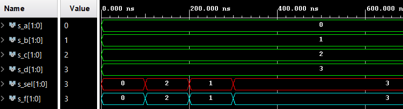

# Lab 3: Vivado
### [Github Link](https://github.com/xjanus10/Digital-electronics-1/blob/main/Labs/03-vivado/README.md)

## 1) Switches & LED table
| **Switch** | **Switch port** | **LED** | **LED port** |
| :-: | :-: | :-: | :-: |		     
| SW0 | J15 | LED0 | H17 |		     
| SW1 | L16 | LED1 | K15 |		     
| SW2 | M13 | LED2 | J13 |	            			
| SW3 | R15 | LED3 | N14 |		 
| SW4 | R17 | LED4 | R18 |		     
| SW5 | T18 | LED5 | V17 |	             
| SW6 | U18 | LED6 | U17 |	             
| SW7 | R13 | LED7 | U16 |
| SW8 | T8 | LED8 | V16 |
| SW9 | U8 | LED9 | T15 |
| SW10 | R16 | LED10 | U14 |
| SW11 | T13 | LED11 | T16 |
| SW12 | H6 | LED12 | V15 |
| SW13 | U12 | LED13 | V14 |
| SW14 | U11 | LED14 | V12 |
| SW15 | V10 | LED15 | V11 |

## 2) Two-bit wide 4-to-1 multiplexer

### VHDL architecture
mux_2bit_4to1.vhd

```vhdl
architecture Behavioral of mux_2bit_4to1 is
begin
       f_o <= a_i when (sel_i = "00" ) else
              b_i when (sel_i = "01" ) else
              c_i when (sel_i = "10" ) else
              d_i;
end architecture Behavioral;
```

### VHDL stimulus process
tb_mux_2bit_4to1.vhd

```vhdl
p_stimulus : process
    begin
        s_a <= "00"; s_b <= "01"; s_c <= "10"; s_d <= "11";
        s_sel <= "00"; wait for 100 ns;
        
        s_a <= "00"; s_b <= "01"; s_c <= "10"; s_d <= "11";
        s_sel <= "10"; wait for 100 ns;
        
        s_a <= "00"; s_b <= "01"; s_c <= "10"; s_d <= "11";
        s_sel <= "01"; wait for 100 ns;
        
        s_a <= "00"; s_b <= "01"; s_c <= "10"; s_d <= "11";
        s_sel <= "11"; wait for 100 ns;        
        wait;
    end process p_stimulus;
```
### Waveforms


## 3) Vivado tutorial

### project creation
# Name and directory selection

# Choosing the type of project

# Adding design sources


# Press Finish to create project


### adding source file


### running simulation


