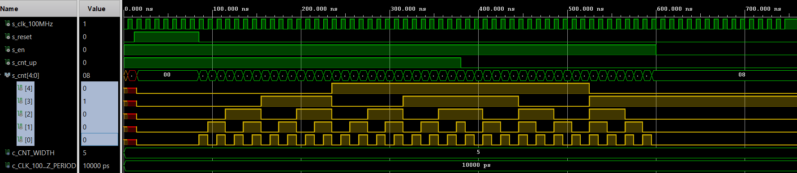

# Lab 5: Counter
### Github link: https://github.com/xjanus10/Digital-electronics-1/tree/main/Labs/05-counter

## 1. Preparation Tasks
### Table with connection of push buttons on Nexys A7 board

| **Button** | **Pin** | **Voltage disabled** |  **Voltage enabled** |
   | :-: | :-: | :-: | :-: |
   | BTNL | P17 | 0 V | 3,3 V | 
   | BTNR | M17 | 0 V | 3,3 V | 
   | BTNU | M18 | 0 V | 3,3 V | 
   | BTND | P18 | 0 V | 3,3 V | 
   | BTNC | N17 | 0 V | 3,3 V | 
   | BTNRES | C12 | 0 V | 3,3 V |

### Table with Calculated Values

| **Time interval** | **Number of clk periods** | **Number of clk periods in hex** | **Number of clk periods in binary** |
| :-: | :-: | :-: | :-: |
| 2 ms | 200 000 | ```x"3_0d40"``` | ```b"0011_0000_1101_0100_0000"``` |
| 4 ms | 400 000 | ```x"6_1a80"``` | ```b"0110_0001_1010_1000_0000"``` |
| 10 ms | 1 000 000 | ```x"F_4240"``` | ```b"1111_0100_0010_0100_0000"``` |
| 250 ms | 25 000 000 | ```x"17d_7840"``` | ```b"0001_0111_1101_0111_1000_0100_0000"``` |
| 500 ms | 50 000 000 | ```x"2fa_f080"``` | ```b"0010_1111_1010_1111_0000_1000_0000"``` |
| 1 sec | 100 000 000 | ```x"5F5_E100"``` | ```b"0101_1111_0101_1110_0001_0000_0000"``` |


## 2. Bidirectional counter

### p_cnt_up_down
```vhdl
p_cnt_up_down : process(clk)
begin
    if rising_edge(clk) then
        if (reset = '1') then
        s_cnt_local <= (others => '0');
        elsif (en_i = '1') then  
            if (cnt_up_i = '1') then
            s_cnt_local <= s_cnt_local + 1;             
            else 
            s_cnt_local <= s_cnt_local - 1;            
            end if;
        end if;
    end if;
end process p_cnt_up_down;
```

### tb_cnt_up_down.vhd
```vhdl
p_reset_gen : process
begin
    s_reset <= '0';
    wait for 12 ns;
    s_reset <= '1'; -- reset
    wait for 73 ns;
    s_reset <= '0';
    wait;
end process p_reset_gen;

p_stimulus : process
begin
    report "Stimulus process started" severity note;
    s_en     <= '1'; -- enable
    s_cnt_up <= '1';
    wait for 380 ns;
    s_cnt_up <= '0'; -- change direction
    wait for 220 ns;
    s_en     <= '0'; -- disable
    report "Stimulus process finished" severity note;
    wait;
end process p_stimulus;
```

### simulated time waveforms


## 3. Top level

### top.vhd (with 4-bit bidirectional counter)
```vhdl
clk_en0 : entity work.clock_enable
    generic map(
        g_MAX => 100000000
    )

    port map(
        clk   => CLK100MHZ,
        reset => BTNC,
        ce_o  => s_en
    );

bin_cnt0 : entity work.cnt_up_down
    generic map(
        g_CNT_WIDTH => 4
    )

    port map(
        clk      => CLK100MHZ,
        reset    => BTNC,
        en_i     => s_en,
        cnt_up_i => SW(0),
        cnt_o    => s_cnt
    );

LED(3 downto 0) <= s_cnt;

hex2seg : entity work.hex_7seg
    port map(
        hex_i    => s_cnt,
        seg_o(6) => CA,
        seg_o(5) => CB,
        seg_o(4) => CC,
        seg_o(3) => CD,
        seg_o(2) => CE,
        seg_o(1) => CF,
        seg_o(0) => CG
    );

AN <= ```b"1111_1110"```; -- add AN
```
### Image of the top layer including both counters
#### 4-bit bidirectional counter diagram

#### 16-bit bidirectional counter diagram

