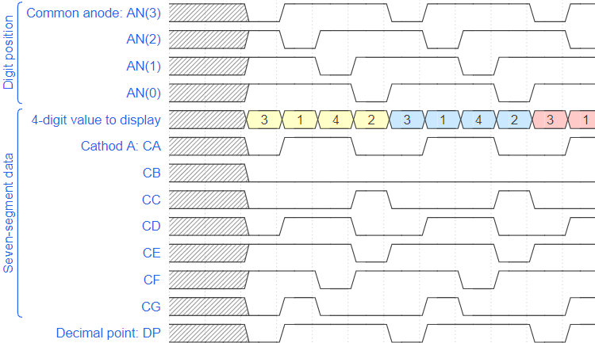
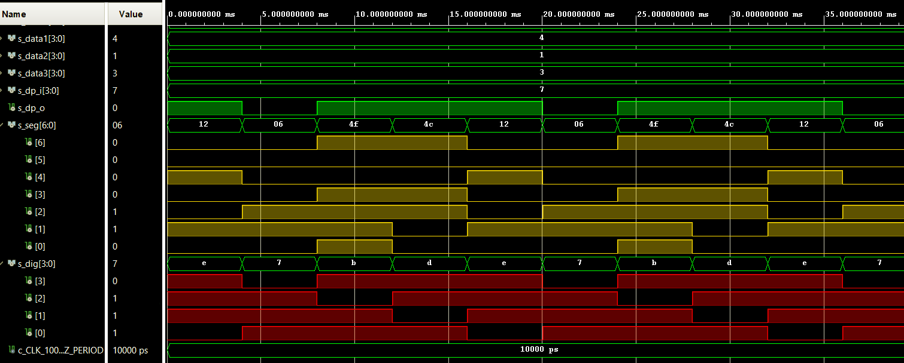
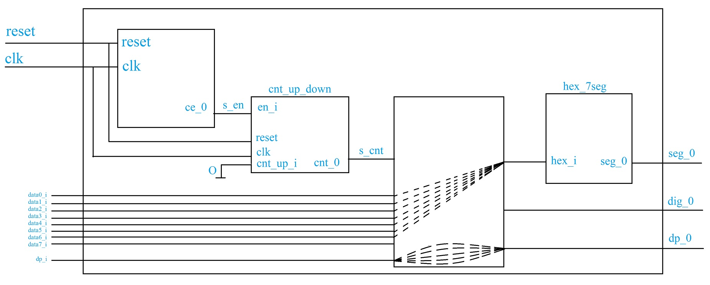

# Lab 6: Display driver
### Github link: https://github.com/xjanus10/Digital-electronics-1/tree/main/Labs/06-display-driver

## 1. Preparation Tasks

### Timing diagram figure



## 2. Display driver

### ```p_mux```
```VHDL
p_mux : process(s_cnt, data0_i, data1_i, data2_i, data3_i, dp_i)
begin
    case s_cnt is
        when "11" =>
        s_hex <= data0_i;
        dp_o  <= dp_i(3);
        dig_o <= "0111";

        when "10" =>
        s_hex <= data1_i;
        dp_o  <= dp_i(2);
        dig_o <= "1011";

        when "01" =>
        s_hex <= data2_i;
        dp_o  <= dp_i(1);
        dig_o <= "1101";

        when others =>
        s_hex <= data3_i;
        dp_o  <= dp_i(0);
        dig_o <= "1110";        
    end case;
    
end process p_mux;
```

### ```tb_driver_7seg_4digit```
```VHDL
-- Entity declaration for testbench
entity tb_driver_7seg_4digits is

end entity tb_driver_7seg_4digits;

-- Architecture body for testbench
architecture testbench of tb_driver_7seg_4digits is

    constant c_CLK_100MHZ_PERIOD : time    := 10 ns;

    signal s_clk_100MHz : std_logic;
    signal s_clk        : std_logic;
    signal s_reset      : std_logic;

    signal s_data0_i    : std_logic_vector(4 - 1 downto 0);
    signal s_data1_i    : std_logic_vector(4 - 1 downto 0);
    signal s_data2_i    : std_logic_vector(4 - 1 downto 0);
    signal s_data3_i    : std_logic_vector(4 - 1 downto 0);
    signal s_dp_i       : std_logic_vector(4 - 1 downto 0);

    signal s_dp_o       : std_logic;
    signal s_seg_o      : std_logic_vector(7 - 1 downto 0);
    signal s_dig_o      : std_logic_vector(4 - 1 downto 0);
    
    begin
    uut_driver_7seg_4digits : entity work.driver_7seg_4digits
        port map ( 
            clk     => s_clk_100MHz,
            reset   => s_reset,

            data0_i => s_data0_i,
            data1_i => s_data1_i,
            data2_i => s_data2_i,
            data3_i => s_data3_i,

            dp_i    => s_dp_i,

            dp_o    => s_dp_o,
            seg_o   => s_seg_o,
            dig_o   => s_dig_o
        ); 

    p_clk_gen : process
    begin
        while now < 750 ns loop
            s_clk_100MHz <= '0';
            wait for c_CLK_100MHZ_PERIOD / 2;
            s_clk_100MHz <= '1';
            wait for c_CLK_100MHZ_PERIOD / 2;
        end loop;
        wait;
    end process p_clk_gen;

    -- Reset generation process
    p_reset : process 
    begin      
        s_reset <= '0';
        wait for 28 ns;

        s_reset <= '1';
        wait for 53 ns;

        s_reset <= '0';
        wait;
    end process p_reset;

    -- Data generation process
    p_stimulus : process
    begin
        report "Stimulus process started" severity note;
        s_data3 <= "0011";
        s_data2 <= "0001";
        s_data1 <= "0100";
        s_data0 <= "0010";
               
        s_dp_i  <= "0111";
        wait for 6 ms;
        
        assert ((s_seg = "0000110") and (s_dig = "0111") and (s_dp_o = '0'))
        report "Error (3.) " severity error;
        wait for 4 ms;
        
        assert ((s_seg = "1001111") and (s_dig = "1011") and (s_dp_o = '1'))
        report "Error (1)" severity error;
        wait for 4 ms;
        
        assert ((s_seg = "1001100") and (s_dig = "1101") and (s_dp_o = '1'))
        report "Error (4)" severity error;
        wait for 4 ms;
        
        assert ((s_seg = "0010010") and (s_dig = "1110") and (s_dp_o = '1'))
        report "Error (2)" severity error;

        report "Stimulus process finished" severity note;
        wait;
    end process p_stimulus;

end architecture testbench;
```

### Simulated time waveforms


### Top layer VHDL architecture
```VHDL
architecture Behavioral of top is
begin
    driver_seg_4 : entity work.driver_7seg_4digits
        port map(
            clk        => CLK100MHZ,
            reset      => BTNC,
            -- 3, 2, 1, 0
            data0_i(3) => SW(3),
            data0_i(2) => SW(2),
            data0_i(1) => SW(1),
            data0_i(0) => SW(0),
            -- 7, 6, 5, 4
            data1_i(3) => SW(7),
            data1_i(2) => SW(6),
            data1_i(1) => SW(5),
            data1_i(0) => SW(4),
            -- 11, 10, 9, 8
            data2_i(3) => SW(11),
            data2_i(2) => SW(10),
            data2_i(1) => SW(9),
            data2_i(0) => SW(8),
            -- 15, 14, 13, 12
            data3_i(3) => SW(15),
            data3_i(2) => SW(14),
            data3_i(1) => SW(13),
            data3_i(0) => SW(12),
            -- CA-CG
            seg_o(6)   => CA,
            seg_o(5)   => CB,
            seg_o(4)   => CC,
            seg_o(3)   => CD,
            seg_o(2)   => CE,
            seg_o(1)   => CF,
            seg_o(0)   => CG,
            -- DP
            dp_o => DP,
            -- AN
            dig_o => AN(4 - 1 downto 0)
        );

    AN(7 downto 4) <= b"1111";

end architecture Behavioral;
```

## 3. Eight-digit driver
### Driver schematic


